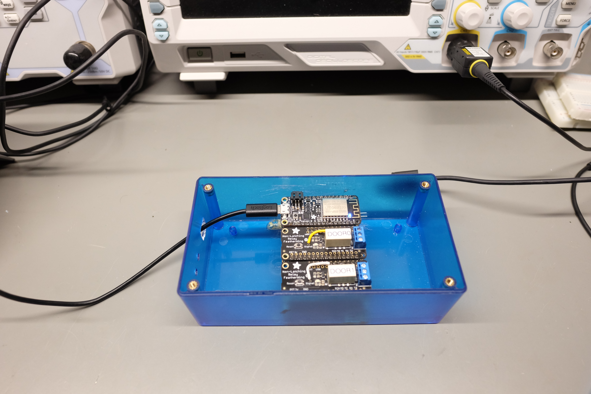
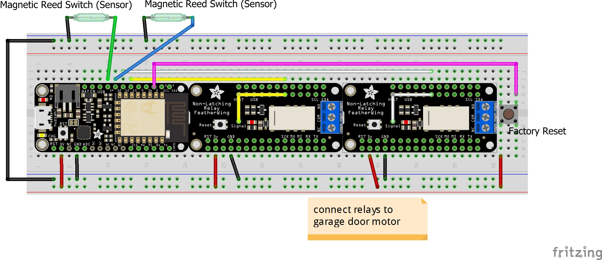

# Garage-O-Matic

Have you ever left your home and can't remember if you closed the garage door?  Or did you remember you left the garage 
door open after you just finished a 2 hour commute to work, and now you have to turn around to go back
so you can close the garage door?  You need Garage-O-Matic!

This project uses simple magnetic reed switches to sense if the garage door is open/closed, and a non-latching relay
hooked up to the same circuit that your garage door wall switch uses to open/close the door.  This is all connected
to the general purpose i/o (GPIO) of a microprocessor (ESP8266).

## Getting Started

You will need to prototype the circuit first.  While you can get some of these parts through cheaper sources such as ebay,
I like to buy mine from Adafruit to support all of the work they've done.  I really like the Arduino compatible
Adafruit Feather line.  I used a Feather Huzzah for this project, along with a couple Feather non-latching relays,
and mounted all of this on to a Feather Tripler Protoboard.  However, the code should be compatible with any of the
cheap nodemcu ESP8266 compatible boards and you can substitute the Feather non-latching relays for something like
a cheaper 2 channel module https://www.amazon.com/SainSmart-101-70-100-2-Channel-Relay-Module/dp/B0057OC6D8

PARTS:

    Adafruit Feather Huzzah ESP8266
    https://www.adafruit.com/product/2821

    Adafruit Feather Non-latching Relay
    https://www.adafruit.com/product/2895

    Adafruit Featherwing Tripler Mini Kit
	This is an easy way to mount the micro and relays
    https://www.adafruit.com/product/3417

### Breadboard/Prototype Circuit

### Prerequisites

You will need the Arduino - make sure to install the proper board
support using the Arduino IDE Board Manager option
https://www.arduino.cc/en/Main/Software

Install the following libraries into your Arduino/Libraries folder

MQTT support
https://github.com/adafruit/Adafruit_MQTT_Library

ESP8266 Core Library for Arduino
https://github.com/esp8266/Arduino

Optional - I used Visual Studio 2017 with the Visual Micro add-on.  It is much easier
to browse types, see declarations/definitions, etc. than it is in the Arduino IDE.

## Building/Installing

1.  Open the garage-o-matic.ino file in the Arduino IDE.
1.  Select the proper board you are using by selecting Tools->Boards->Board Manager from within the IDE
1.  Verify the software builds successfully
1.  Upload to the device

After you have flashed the firmware to the device, it will be in factory default mode. 
Factory default mode puts the device into Access Point (AP) mode.  Connect to the 
garage-o-matic SSID, open your browser to the device's IP address http://192.168.99.1
and then configure the device with your wlan, the mqtt broker, and a device
username/password, which you will need to make any calls to the REST endpoints.

## Using

You interact with Garage-o-Matic via REST API endpoints secured with DIGEST authentication. This 
allows you to integrate garage-o-matic with a wide variety of tools, such as curl in a script,
node-red, or even a browser.

Status  
http://garage-o-matic/garage/door/status/# where # is the garage door number. This will return
a application/text message of open/closed depending on if the door is open or closed.

Closing a door  
http://garage-o-matic/garage/door/command/{open|close}/# Note you can only issue a close command
if the door is open, or an open command if the door is closed.

## Examples

Example - check the status of garage door 0  
http://garage-o-matic/garage/door/status/0

Example - open garage door 0  
http://garage-o-matic/garage/door/command/open/0

Example - close garage door 0  
http://garage-o-matic/garage/door/command/close/0

Factory Reset  
If you want to reconfigure the device, then you need to pull GPIO 16 HIGH while rebooting/reseting 
the device. The LEDs will wig-wag to indicate that the previous configuration has been deleted. 
Make sure to stop pulling GPIO 16 HIGH before the next reset.

## Security

Ideally, all network communication would be TLS/SSL encrypted, the configuration stored on 
the SPIFF file system would be encrypted, etc. However, the current ESP8266 core library 
does not have TLS/SSL support for the web server,and I did not find any ESP8266 hardware 
features to act as a TPM/keystore.  

This device can open/close your garage door(s).  The endpoints are secured using DIGEST 
authentication, which means the access credentials are MD5 hashed with a nonce.  Since the
network channel is not encrypted, it is possible for an attacker to see the http data including
the MD5 hashed digest credentials.  For your local home network, this should be sufficient given
the "threat risk."  However, I strongly do not recommend port forwarding Internet traffic from outside
your firewall to the IP/port of the garage-o-matic (for example, if you want to do some IFTTT 
integration).  That would give someone with enough time to crack the digest authentication against
rainbow tables, try replay attacks, or other bad things. If you REALLY want to do that, then you
must use some sort of TLS/SSL proxy, which is outside the scope of this doc to discuss.

For the MQTT publishing, I run a MQTT server on my home network. Since this data stays on my
local network, and it is only status data, the risk of interception is low, and even if it is
intercepted, it cannot be used to control the device.  If you decide to pass this data
to a MQTT broker on the Internet (example - AWS), then please make sure to encrypt the data.
The status meta-data could be used to build a profile of patterns (such as when you leave or come
home each day), which could be used for bad things.

## Authors

* **Sean Foley** - *Initial work*

## License

You are free to use this code anyway you see fit.

## Acknowledgments

I started to write my own wifi configuration portal and then I found WifiManager.
That saved me all kinds of time - thank you! I included the code in this project
to make it simpler to build (less inital library installs), but you can find the
latest/greatest on github
https://github.com/tzapu/WiFiManager

I wanted digest auth to secure the endpoints and was about to write my own.  Then I noticed that 
the ESP8266WebServer class had digest auth added just a couple months ago.  When I pulled 
the entire ESP8266 core down, it caused a lot of side-effects and broke functionality, so I 
used OO subclassing techniques and ported the digest code into the ExtendedWebServer class.  
This should make it trival to remove and use the official ESP8266WebServer code once the next 
major core is released.  Major thanks!

Digest auth that was added to ESP8266WebServer
https://github.com/esp8266/Arduino/commit/eebc5ec593a8c739f8da2612a0e25ff4dab982fb#diff-b78105e1729cc548e062483fec020a9b

Constant time string compare from WString
https://github.com/esp8266/Arduino/commit/03f1a540caa5af96a686db81fc3a21b9936dd4a7#diff-3d1eaec7ee8f9cdadc75a401477867a0

Big thanks for the readme.md template
https://gist.github.com/PurpleBooth/109311bb0361f32d87a2